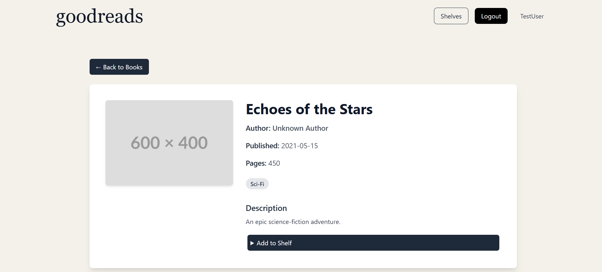

# GoodReads Frontend

## Things used 
- Tailwind css
- react-icons
- react-hot-toast
- eslint config for auto sort imports on file save
- react-router
- Absolute imports setup
- Redux Toolkit
- Authentication

